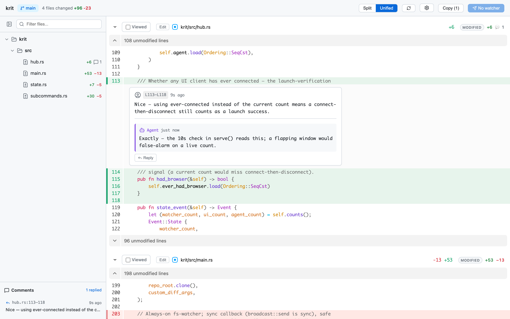

# krit

A local code review tool designed for the coding-agent workflow. Review AI-generated changes in a GitHub-PR-like web UI, leave inline comments, and have your agent respond to them live as you write them — reply, resolve, and rewrite without leaving the review.

krit is a single static Rust binary with the web UI embedded.



## Install

```bash
cargo install --git https://github.com/kmosher/krit krit
# or from a checkout:
just install
```

The build embeds the web UI and rebuilds it automatically when UI sources change (requires `pnpm`; set `KRIT_SKIP_UI_BUILD=1` to embed `dist/client` as-is).

## Usage

Run in any git repository:

```bash
krit
```

This starts a local server on a random available port and opens the review UI — a browser tab by default, or the desktop app (below). The server waits for inline comments; click **Done reviewing** when finished (Ctrl+C to abort).

### Desktop app

`desktop/` is a thin [Tauri](https://v2.tauri.app/) shell (krit.app) that gives each review its own window under one dock icon instead of a browser tab. Build and wire it up:

```bash
cargo install tauri-cli --version "^2"       # one time
cd desktop/src-tauri && cargo tauri build    # → target/release/bundle/macos/krit.app
```

Move `krit.app` to `/Applications`, launch it once so macOS registers the `krit://` scheme, then set `{ "launcher": "app" }` in `~/.config/krit/settings.json`. See `desktop/README.md` for details.

### Settings

`~/.config/krit/settings.json` persists preferences across sessions, including `launcher` (`"browser"` default, or `"app"`), `diffStyle` (`"split"` / `"unified"`), `defaultTabSize`, the `staged` / `untracked` toggles, and `refreshMode`. The in-UI settings panel writes the same file.

### Options

```
krit [options] [-- <git-diff-args>]

Options:
  -p, --port <port>   Server port (default: random available)
  --host <host>       Bind address (default: 127.0.0.1; pass 0.0.0.0 for LAN)
  --no-open           Don't auto-open the UI
  -v, --version       Show version
  -h, --help          Show help

Examples:
  krit                           # Review working tree changes
  krit -- --staged               # Only staged changes
  krit -- HEAD~3                 # Diff against 3 commits ago
  krit -- main..HEAD             # Diff between branches
  krit --host 0.0.0.0            # Allow other machines on the LAN to review
```

### Session subcommands

While a `krit` server is running, the same binary works as a client for it, auto-discovered via a state file (`$KRIT_STATE_FILE`, else `$CLAUDE_TMPDIR/krit-state.json`, else `~/.krit/state-<hash(cwd)>.json`):

```
krit state                        # Print state JSON (port, pid, url, etc.)
krit comments [open|resolved|replied|all]
krit reply <id> <text...>         # Reply to a comment (tagged author: 'agent')
krit resolve <id>                 # Mark a comment resolved
krit reopen <id>                  # Reopen a resolved comment
krit refresh                      # Re-diff and push updates to the UI
krit wait-for-submit              # Block until the user clicks Done reviewing
```

The WebSocket endpoint `ws://<host>:<port>/api/events-ws` is the integration point for an agent responding to comments live — each new comment or user reply arrives as one JSON frame. The stream carries only human-originated events (the agent's own replies and file edits don't echo back), so there's no self-feedback loop.

## Features

- **Split / Unified view** — Toggle between side-by-side and inline diff
- **Syntax highlighting** — Powered by Shiki with GitHub themes; respects `.editorconfig` for per-file tab size
- **File tree** — Hierarchical browser with search filter, collapsible sidebar, and file change-type icons
- **Inline comments** — Click the `+` on any line, or **drag the gutter** across a range; select text for character-anchored comments
- **Suggested edits** — Rewrite the selected code inline; the agent (or the UI) can apply it to the working tree
- **Conversation threads** — Reply from the browser; agents reply via `krit reply`. Replying to a resolved comment auto-reopens it.
- **Live refresh** — A filesystem watcher re-diffs as the agent edits; comments re-anchor to their new positions
- **Expandable context** — Expand unedited lines above, below, and between hunks; lazy-loaded per file
- **Comment status tracker** — Sidebar widget with draft / open / replied / resolved counts and click-to-navigate
- **Drafts** — Save comments invisibly to the agent until you post them (or finish the review)
- **Copy comments** — One-click copy as structured XML for an offline agent
- **Image preview** — Side-by-side comparison for added, modified, and deleted images
- **Viewed tracking / Staged & Untracked toggles / custom `git diff` args / persistent settings**

## Agent skills

`skills/krit/` in this repo is a Claude Code skill exposing the streaming review loop as **`/krit`**: the agent launches the server, subscribes to the WebSocket, and replies/resolves as you comment; the session ends when you click **Done reviewing**.

Batch-style without an attached agent: click **Copy** in the toolbar and paste the XML into any chat.

## Comment output format

"Copy comments" produces structured XML (`<code-review-comments version="2">`): one `<file>` per path, one `<comment>` per thread with `line`/`endLine` attributes and the commented code as `+`/`-`-prefixed diff lines inside `<code>`, XML-escaped. The `version` attribute lets consumers detect shape changes.

## Development

```bash
just            # list targets
just install    # cargo install --path krit (embeds a fresh UI build)
just test       # Rust tests + TS typecheck
just check      # fmt + clippy + typecheck
just dev        # vite dev server (UI) — pair with a debug-build krit server
```

## License

MIT — original diffx © [wong2](https://github.com/wong2); krit and later work © Keith Mosher. See [LICENSE](LICENSE).
